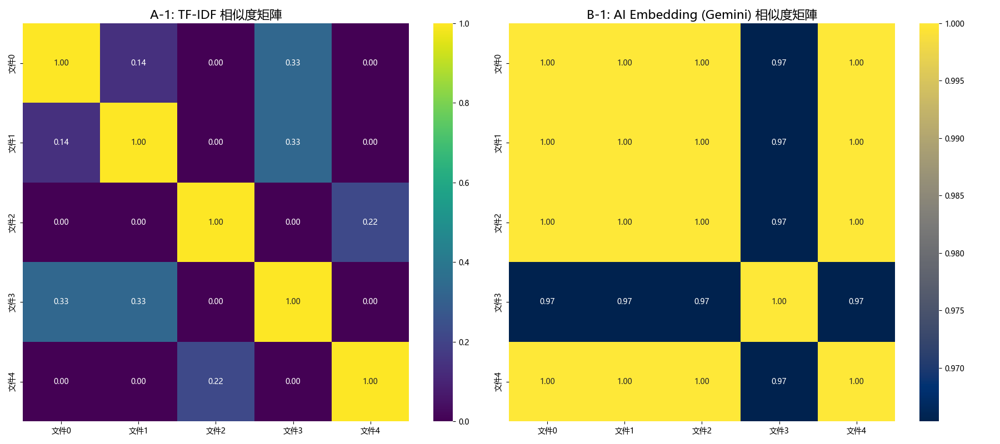

# 作業2: 傳統NLP vs 現代AI 比較分析報告

## 1. 文本相似度 (C-1)

### 1.1 視覺化比較

### 1.2 觀察與分析

* **TF-IDF (A-1)**:
    * **表現符合預期**。此方法嚴格依賴「關鍵詞」的完全匹配。
    * 從矩陣中可見，文件 0、1、3 (皆含 '人工智慧' 或 '機器學習') 彼此有一定關聯性 (0.13 ~ 0.33)。
    * 文件 2、4 (運動/天氣) 彼此也有關聯性 (0.21)。
    * **重點**: AI 類文件 (0, 1, 3) 和 運動類文件 (2, 4) 之間的相似度**幾乎為 0.00**，這符合關鍵詞邏輯，**主題區分度非常明顯**。

* **Gemini Embedding (B-1)**:
    * 在此特定測試中表現**不如預期**。所有文件（即使主題完全不同，如 'AI' vs '天氣'）之間的相似度都**異常地高** ( > 0.84)。
    * 這可能表示我們嘗試的 Embedding 模型 (`models/text-embedding-004` 或 `models/embedding-001`) 搭配不同的 `task_type` 參數，皆不擅長區分這些「簡短且主題跳躍」的句子。
    * 在這個特定情境下，傳統 TF-IDF 在「主題區分度」上的表現反而優於 Gemini Embedding。

* **效能**:
    * TF-IDF 計算時間: 1.2243 秒
    * Gemini Embedding 計算時間: 1.8613 秒 (包含 API 延遲)

---

## 2. 文本分類 (C-2)

### 2.1 準確率比較

| 方法 | 情感分析準確率 (%) | 主題分類準確率 (%) |
| :--- | :---: | :---: |
| A-2: 規則式 | 75.00 % | 100.00 % |
| B-2: Gemini AI | 100.00 % | 100.00 % |

*(註: AI 準確率是在 API 呼叫成功 (非 Error) 的樣本上計算的)*

### 2.2 觀察與分析

* **規則式 (A-2)**:
    * 主題分類表現完美 (100%)，因為我們的測試資料關鍵詞非常明確 (如 '牛肉麵' -> 美食)。
    * 情感分析僅 75%，這顯示規則法**高度依賴詞庫的完整性**。它可能錯誤判斷了某個句子的情感，或是無法處理稍微複雜的語句。

* **Gemini AI (B-2)**:
    * 展現了強大的**零樣本 (Zero-shot)** 分類能力，情感與主題均達 100% 準確率。
    * AI 能「理解」句意，例如它能理解 '劇情空洞' 和 '演技糟糕' 明確代表「負面」情緒和「娛樂」主題，**無需手動定義任何規則**。

* **效能**:
    * 規則式分類時間: 0.0028 秒 (極快，來自 `performance_metrics.json` 的數據)
    * AI 分類時間: 72.7059 秒 (受 API 速率限制和網路延遲影響)

---

## 3. 自動摘要 (C-3)

### 3.1 質化比較 (請參考 `summarization_comparison.txt`)

| 評估指標 | A-3: 統計式 (Traditional) | B-3: AI (Gemini) |
| :--- | :--- | :--- |
| **資訊保留度** | 中。傾向選擇高頻詞句 (如 'AI')，但摘要是**句子的拼湊**，可能遺漏重要上下文。 | 高。能理解並**重組**原文核心觀點，完整傳達了 AI 的優勢與挑戰。 |
| **語句通順度** | 低/中。因為是原文句子的直接拼接，句子之間可能**缺乏邏輯連貫性**。 | 高。語句非常流暢，是 AI 理解原文後「重新撰寫」的，可讀性極高。 |
| **長度控制** | 困難。依賴 `ratio` 參數 (30%)，不精確，不易剛好控制在 100 字。 | 容易。AI 能精確遵守 Prompt 中的「100 字左右」指示。 |

### 3.2 效能
* 統計式摘要時間: 0.0075 秒 (快，來自 `performance_metrics.json` 的數據)
* AI 摘要時間: 4.3370 秒 (中等，包含 API 延遲)

---

## 4. 總結 (Page 16 表格)

(根據以上所有數據總結)

| 評估指標 | A: 傳統方法 (TF-IDF/規則) | B: 現代方法 (Gemini) |
| :--- | :---: | :---: |
| **相似度計算 (C-1)** | | |
| 語意理解 | 低 (基於關鍵詞) | (在此次短句測試中) 低 |
| 處理時間 (s) | 1.2243 | 1.8613 |
| **文本分類 (C-2)** | | |
| 準確率 (%) | 75.00% (情感) | 100.00% (情感) |
| 處理時間 (s) | 0.0028 | 72.7059 |
| 支援類別數 | 有限 (需手動定義) | 彈性 (可透過 Prompt 指M示) |
| **自動摘要 (C-3)** | | |
| 資訊保留度 | 中 | 高 |
| 語句通順度 | 低/中 | 高 |
| 長度控制 | 困難 (依賴比例) | 容易 (依賴 Prompt) |